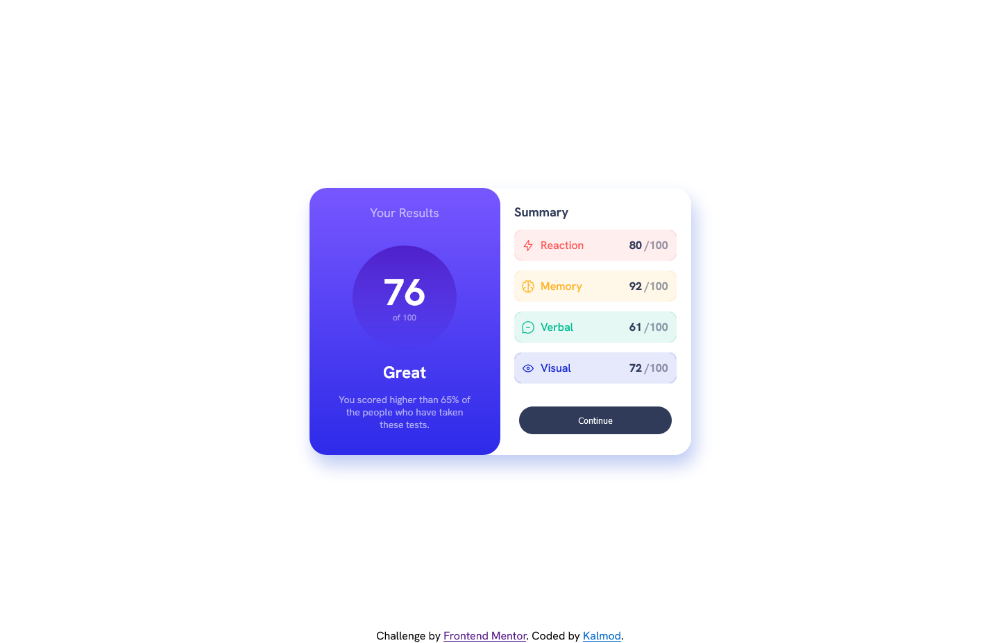

# Frontend Mentor - Results summary component solution

This is a solution to the [Results summary component challenge on Frontend Mentor](https://www.frontendmentor.io/challenges/results-summary-component-CE_K6s0maV). Frontend Mentor challenges help you improve your coding skills by building realistic projects. 

## Table of contents

- [Overview](#overview)
  - [The challenge](#the-challenge)
  - [Attack Plan](#attack-plan)
  - [Screenshot](#screenshot)
  - [Links](#links)
- [My process](#my-process)
  - [Built with](#built-with)
  - [What I learned](#what-i-learned)
  - [Continued development](#continued-development)
  - [Useful resources](#useful-resources)
- [Author](#author)

## Overview

### The challenge

Users should be able to:

- View the optimal layout for the interface depending on their device's screen size
- See hover and focus states for all interactive elements on the page

### Attack Plan
1. Desktop Mode
  - Elements should be centered.
  - 1 container gird - 2 Inner cards | Same size
  - Left Card: Title - Circle (text not centered) - Text
  - Right card: 3 divs, center contains summary.
2. Mobile Mode
  - I'm going to need a media querie to handle the change in layout.
  - Should go from a Horizontal to vertical layout
  - Continue button changes color.


### Screenshot




### Links

- Solution URL: [frontendmentor_result_summary](https://github.com/kalmod/frontendmentor_result_summary)
- Live Site URL: [Live URL](kalmod.github.io/frontendmentor_result_summary)

## My process

### Built with

- HTML
- CSS
  - Flexbox
- Javascript
### What I learned

It's possible to use Margin with Flexbox to change the layout of Flex Children.
[The peculiar magic of flexbox and auto margins](https://css-tricks.com/the-peculiar-magic-of-flexbox-and-auto-margins/)


Imports don't work in FireFox. Need to create and XMLHttpRequest object instead.
```js
    import data from './data.json' assert {type: 'json'}
    updateScoreSummary(data);
    
    function updateScoreSummary(JSONdata){
      for (let jd of JSONdata){
        const sp = document.querySelector(`.${jd['category'].toLowerCase()} > p:last-child > span:first-child`);
        sp.textContent = jd['score'];
      }
    }
```

If you want more help with writing markdown, we'd recommend checking out [The Markdown Guide](https://www.markdownguide.org/) to learn more.


### Continued development

Use this section to outline areas that you want to continue focusing on in future projects. These could be concepts you're still not completely comfortable with or techniques you found useful that you want to refine and perfect.


### Useful resources

- [FrontEnd Mentor Submission Guide](https://medium.com/frontend-mentor/a-complete-guide-to-submitting-solutions-on-frontend-mentor-ac6384162248)
- [W3Schools CSS @media RUle](https://www.w3schools.com/cssref/css3_pr_mediaquery.php)
- [Display None](https://www.w3schools.com/css/css_display_visibility.asp)
- [Corner Border using Gradients](https://stackoverflow.com/a/61913549) - I'll need to revisit this. Don't entirely understand what's going on here.


## Author

- Website - [Kalmod](https://github.com/kalmod)
- Frontend Mentor - [@kalmod](https://www.frontendmentor.io/profile/kalmod)


